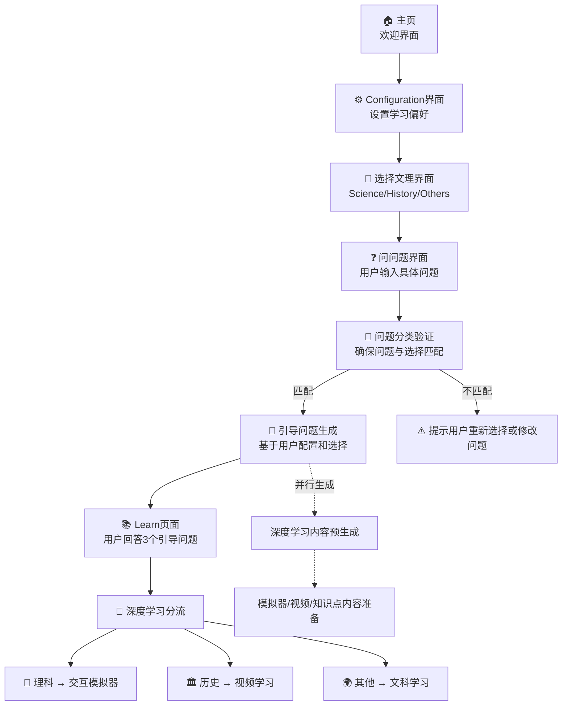

# Dify 工作流架构设计

## 📋 概述

本工作流设计采用用户主导的学习流程，让用户先配置学习偏好，再选择感兴趣的学科类型，最后针对性地提出问题。系统通过智能验证确保问题与选择匹配，然后生成个性化的引导问题，最终提供专业的深度学习体验。

## 🔄 新工作流架构

### **完整学习流程**



### **核心优势**

1. **用户主导**：用户主动选择学习方向，提高学习积极性
2. **个性化配置**：提前配置学习偏好，确保内容适配
3. **智能验证**：确保问题与选择匹配，避免分类错误
4. **渐进式学习**：从配置到问题到深度学习的自然过渡

## 📊 详细流程说明

### **第一阶段：用户配置与选择**

#### **Step 1: Configuration界面**
- **功能**：用户设置学习偏好
- **配置项**：
  - 知识水平（初学者/中级/高级）
  - 学习风格（结构化/故事化/对话式/导师式等）
  - 学习节奏（详细/快速）
- **输出**：用户配置数据
- **存储**：localStorage['xknow-config']

#### **Step 2: 选择文理界面**
- **功能**：用户主动选择感兴趣的学科领域
- **选项**：
  - 🔬 **Science（理科）**：数学、物理、化学、生物、计算机等
  - 🏛️ **History（历史）**：历史事件、人物、时代背景等
  - 🌍 **Others（其他）**：地理、语言、社会、艺术等
- **输出**：用户选择的学科类型
- **存储**：localStorage['xknow-category']

#### **Step 3: 问问题界面**
- **功能**：用户在选定学科下输入具体问题
- **特点**：
  - 界面显示已选择的学科类型
  - 提供该学科的问题示例
  - 实时输入验证和建议
- **输出**：用户的具体问题
- **存储**：localStorage['xknow-query']

### **第二阶段：智能验证与问题生成**

#### **Step 4: 问题分类验证（classifier-service.ts）**
- **时机**：用户提交问题后立即执行
- **功能**：验证用户问题是否与选择的学科匹配
- **处理器**：分类器LLM
- **输入**：
  - 用户问题
  - 用户选择的学科类型
- **输出**：
  - 匹配度验证结果
  - 置信度评分
  - 不匹配时的建议
- **逻辑**：
  ```typescript
  if (分类结果 === 用户选择) {
    继续生成引导问题
  } else {
    提示用户重新选择或修改问题
  }
  ```

#### **Step 5: 引导问题生成（guided-questions-service.ts）**
- **时机**：验证通过后执行
- **功能**：基于用户配置和选择生成个性化引导问题
- **处理器**：对应学科的专业LLM
- **输入**：
  - 用户问题
  - 用户配置（学习偏好）
  - 用户选择（学科类型）
- **输出**：3个递进式引导问题
- **特点**：充分利用用户的配置信息定制问题风格

### **第三阶段：引导学习与深度学习**

#### **Step 6: Learn页面 - 引导问题学习**
- **功能**：用户回答3个引导问题
- **学习模式**：渐进式思考，自主探索
- **时间估计**：5-10分钟
- **输出**：用户的学习回答

#### **Step 7: 深度学习分流**
- **理科路径**：交互模拟器，通过参数调节理解概念
- **历史路径**：视频内容，沉浸式历史学习
- **文科路径**：知识梳理，系统性概念学习

### **并行优化：内容预生成系统**

在用户进行引导问题学习时，系统并行准备深度学习内容：

#### **模拟器配置生成（理科）**
- **时机**：引导问题生成完成后并行执行
- **功能**：根据问题和用户配置设计交互参数
- **输出**：模拟器配置参数

#### **视频内容生成（历史）**
- **时机**：引导问题生成完成后并行执行
- **功能**：设计个性化历史教学场景
- **输出**：视频脚本或教学设计

#### **知识点梳理（文科）**
- **时机**：引导问题生成完成后并行执行
- **功能**：根据用户配置整理学习要点
- **输出**：结构化学习内容

## 🔧 技术实现要点

### **数据流管理**

#### **用户配置数据**
```typescript
interface UserConfig {
  level: 'beginner' | 'intermediate' | 'expert'
  style: 'structured' | 'story' | 'dialogue' | 'mentor' | 'detailed' | 'quick' | 'poetic' | 'casual' | 'analytical' | 'confucius' | 'novel' | 'einstein'
}
```

#### **学科选择数据**
```typescript
type CategoryChoice = 'science' | 'history' | 'others'
```

#### **问题验证结果**
```typescript
interface ValidationResult {
  isMatched: boolean
  confidence: number
  reasoning: string
  suggestion?: string
}
```

### **API接口设计**

#### **问题验证接口**
```
POST /api/validate-question
{
  "question": "用户问题",
  "selectedCategory": "用户选择的学科",
  "userConfig": "用户配置"
}
```

#### **引导问题生成接口**
```
POST /api/generate-questions
{
  "question": "用户问题",
  "category": "验证后的学科分类",
  "config": "用户配置",
  "stream": true // 支持流式输出
}
```

### **页面流程更新**

#### **新的页面路由**
```
/ (主页) 
  ↓
/configure (配置页面)
  ↓  
/category (选择文理页面，新建)
  ↓
/ask (问问题页面，新建)
  ↓
/learn (引导问题学习)
  ↓
/simulate | /history | /geography (深度学习)
```

#### **新建页面需求**

##### **/category 页面**
- **功能**：让用户选择学科类型
- **UI设计**：三个大卡片展示不同学科
- **状态管理**：保存选择到localStorage

##### **/ask 页面**
- **功能**：用户在选定学科下提问
- **UI设计**：显示已选学科，提供输入框和示例
- **验证逻辑**：调用分类API验证匹配度
- **错误处理**：不匹配时的友好提示

## 🚀 用户体验优势

### **比原流程的改进**

#### **原流程问题**
```
问问题 → AI分类 → 可能分类错误 → 用户困惑
```

#### **新流程优势**
```
配置偏好 → 主动选择学科 → 针对性提问 → AI验证匹配 → 精准生成
```

### **关键提升点**

1. **减少分类错误**：用户主动选择，AI只做验证
2. **提高参与感**：用户全程主导学习路径
3. **个性化增强**：配置信息贯穿整个学习过程
4. **体验连贯性**：从选择到学习的自然过渡

## 📈 实施优先级

### **Phase 1: 核心流程重构**
1. 创建 `/category` 选择页面
2. 创建 `/ask` 问问题页面  
3. 修改分类服务为验证服务
4. 更新页面跳转逻辑

### **Phase 2: 体验优化**
1. 引导问题生成集成用户配置
2. 实现流式问题生成
3. 添加智能提示和示例
4. 完善错误处理和降级方案

### **Phase 3: 高级功能**
1. 问题推荐系统
2. 学习路径记录
3. 个性化内容缓存
4. 学习效果分析

---

*设计理念：用户主导选择，AI智能验证，个性化学习体验，确保每一步都精准匹配用户需求。* 