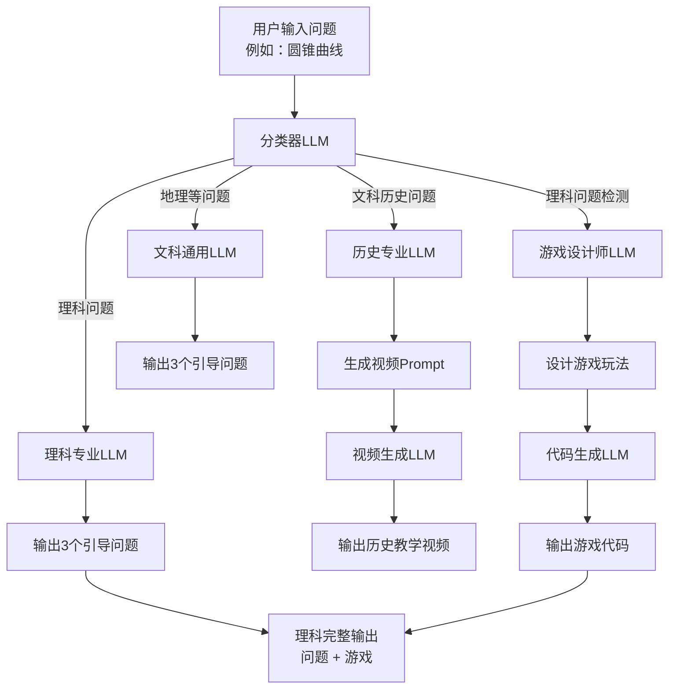

# Dify 工作流架构设计

## 📋 概述

本工作流设计用于智能处理用户学习问题，通过分类器将问题分发到不同的专业LLM处理，同时为理科问题并行生成互动游戏。

## 🔄 工作流架构

### **架构图**



### **主流程：问题分类与处理**

用户输入问题 → 分类器 → 专业LLM处理 → 输出结果

### **并行流程：理科游戏生成**

理科问题 → 游戏设计师LLM → 代码生成LLM → 游戏代码

## 📊 详细流程说明

### **第一阶段：问题分类**
- **输入**：用户问题（如"圆锥曲线"）
- **处理器**：分类LLM
- **输出**：3种分类结果
  - 理科问题
  - 文科历史问题  
  - 地理等其他问题

### **第二阶段：专业处理**

#### **理科分支**
- **处理器**：理科专业LLM
- **功能**：深度分析理科概念
- **输出**：3个引导学习问题

#### **历史分支**
- **处理器**：历史专业LLM
- **功能**：生成历史视频描述
- **流程**：历史LLM → 视频prompt → 视频LLM
- **输出**：历史教学视频

#### **地理等分支**
- **处理器**：文科通用LLM
- **功能**：处理地理、语言等文科问题
- **输出**：3个引导学习问题

### **第三阶段：并行游戏生成（仅理科）**
- **触发条件**：检测到理科问题时自动启动
- **游戏设计师LLM**：
  - 分析理科概念特点
  - 设计互动游戏玩法
  - 输出游戏设计文档
- **代码生成LLM**：
  - 接收游戏设计文档
  - 生成可执行游戏代码
  - 输出完整游戏实现

## 🎯 输出规格

### **理科问题输出**
```json
{
  "questions": ["问题1", "问题2", "问题3"],
  "game": {
    "design": "游戏设计文档",
    "code": "可执行游戏代码"
  }
}
```

### **历史问题输出**
```json
{
  "video": {
    "prompt": "视频生成描述",
    "video_content": "生成的历史教学视频"
  }
}
```

### **地理等问题输出**
```json
{
  "questions": ["问题1", "问题2", "问题3"]
}
```

## 🔧 技术实现要点

### **分类器LLM配置**
- **模型**：高准确率分类模型
- **prompt模板**：包含明确的分类标准
- **输出格式**：标准化分类标签

### **专业LLM配置**
- **理科LLM**：数学、物理、化学专业知识
- **历史LLM**：历史事件、人物、时代背景
- **文科LLM**：地理、语言、社会科学

### **并行处理机制**
- **条件触发**：基于分类结果自动启动
- **异步执行**：主流程与游戏生成并行
- **结果合并**：统一输出格式

## 🎮 游戏生成系统

### **游戏设计师LLM**
- **角色设定**：专业游戏策划师
- **设计原则**：教育性、趣味性、互动性
- **输出标准**：完整的游戏设计文档

### **代码生成LLM**
- **技术栈**：HTML5 Canvas, JavaScript
- **代码规范**：模块化、可维护、高性能
- **集成要求**：与Next.js项目无缝集成

## 🚀 与现有项目集成

### **API接口设计**
```
POST /api/dify/process-question
{
  "question": "用户问题",
  "user_config": "用户配置信息"
}
```

### **响应处理**
- **理科问题**：更新learn页面 + simulate页面
- **历史问题**：展示视频内容
- **其他问题**：更新learn页面

### **性能优化**
- **缓存策略**：常见问题结果缓存
- **异步处理**：游戏生成不阻塞主流程
- **降级方案**：LLM不可用时的静态内容

---

*设计理念：通过智能分类和专业处理，为每种类型的学习问题提供最适合的学习方式，同时为理科问题提供额外的游戏化学习体验。* 